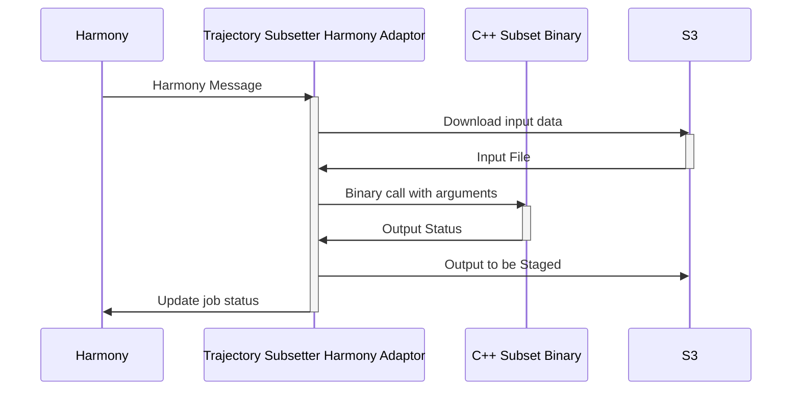

# Trajectory Subsetter Sequence Diagram

```mermaid

sequenceDiagram
    participant H as Harmony
    participant TSA as Trajectory Subsetter Harmony Adaptor
    participant TS as C++ Subset Binary
    participant S3
    H ->> TSA: Harmony Message
    activate TSA
    TSA ->> S3: Download input data
    activate S3
    S3 ->> TSA: Input File
    deactivate S3
    TSA ->> TS: Binary call with arguments
    activate TS
    TS ->> TSA: Output Status
    deactivate TS
    TSA ->> S3: Output to be Staged
    TSA ->> H: Update job status
    deactivate TSA
```
